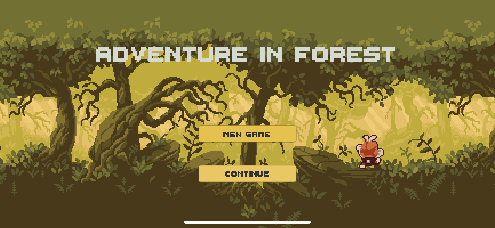
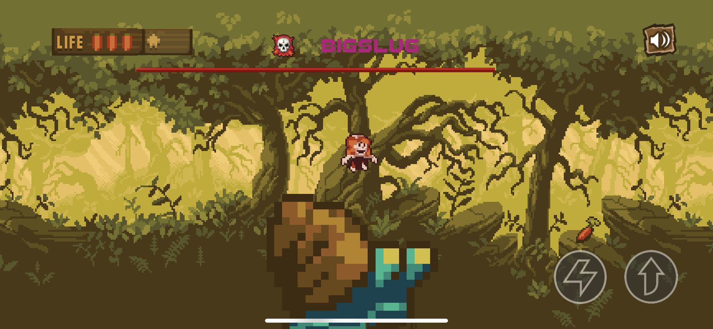

# Adventure-In-Forest

 
unity像素风格的横板过关游戏 
适用于移动平台

- [玩法介绍](#玩法介绍)
- [游戏截图](#游戏截图)
- [所学技术](#所学技术)
- [所用资源](#所用资源)
- [联系方式](#联系方式)

## 玩法介绍
- 玩家可以通过跳跃和冲刺动作通过关卡，关卡设计中加入了自行动和自动攻击玩家的怪物，以及需要通过一定的操作和思考才能通过的关卡。

## 游戏截图
- 开始页面
 
- 游戏内容(白天)
") 
- 游戏内容(夜晚)
") 
- 部分boss截图
 

## 所学技术
- `cinemachine`相机平缓跟随
- `Light2D`2d游戏光照系统(试验版本)
- `TileMap`绘制地图
- 单例控制全局音乐
- 角色技能创建
- boss行动模式控制
- 伤害判定
- 怪物追随
- 无敌时间判定
- 特效使用
- 第三方摇杆控件使用及适用性修改
- 转场动画
- ~~初识pr视频剪辑和b站投稿~~

## 所用资源
1. 来自[爱给网](http://www.aigei.com/)音频资源
2. 来自unity AssetStore的免费资源

## 联系方式
- 邮箱:739296759@qq.com
